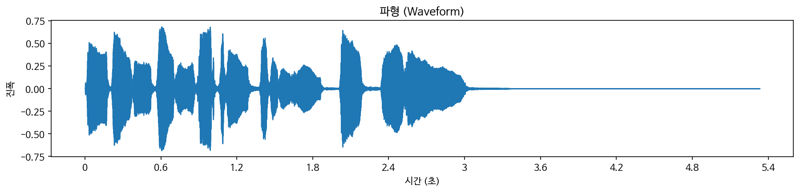
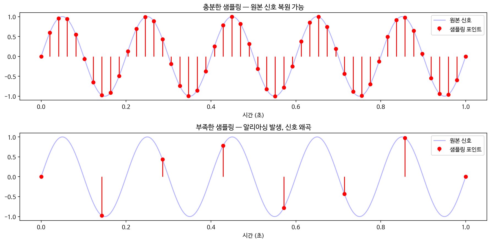
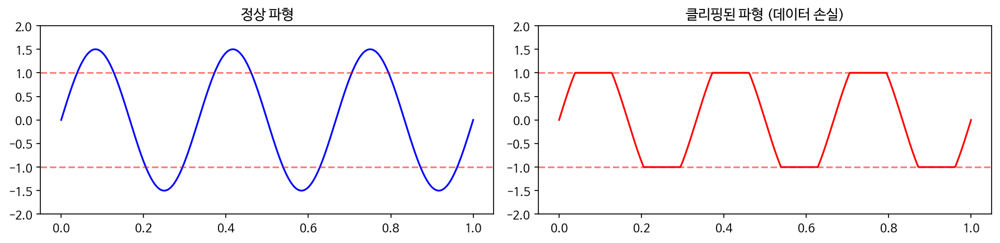

> "소리는 어떻게 컴퓨터가 이해하는 숫자가 될까?"

---

## 1. librosa.load

```python
y, sr = librosa.load('audio.wav')
```

이 코드를 실행하면, 내부에서는 두 가지 일이 일어난다.

**① 숫자 형식을 바꾼다 (Float32 변환)**

WAV 파일은 보통 정수(16비트)로 저장되어 있다.
그런데 Librosa는 이걸 -1.0 ~ 1.0 사이의 실수(float32)로 바꿔서 불러온다.

쉽게 말하면, 악보를 연주하기 좋은 형태로 먼저 정리해두는 것과 비슷하다.

**② 샘플링 주파수를 맞춘다 (Resampling)**

원본 파일이 44,100Hz인데 `sr=22050`으로 불러오면,
Librosa가 자동으로 샘플 수를 줄여준다.

---

## 2. 왜 22,050Hz일까? — 나이퀴스트 이론

Librosa의 기본 샘플링 레이트가 22,050Hz인 데는 이유가 있다.

**샘플링이란?**

소리는 원래 공기의 연속적인 떨림이다.
컴퓨터는 이 연속적인 파동을 1초에 수만 번 측정해서 숫자로 저장한다.
이 측정 횟수가 바로 샘플링 주파수(Hz)이다.

아래는 실제 파형을 시각화한 결과다.



**나이퀴스트-섀넌 샘플링 정리**

소리를 완벽하게 복원하려면 신호에 포함된 가장 높은 주파수의 2배 이상으로 샘플링해야 한다.

$$f_s > 2 \cdot f_{max}$$

사람이 들을 수 있는 최대 주파수는 약 20,000Hz(20kHz)다.
그래서 CD 표준이 44,100Hz가 된 것이다. (20,000 × 2 = 40,000Hz 이상 필요)
22,050Hz는 그 절반으로, 용량은 줄이면서 대부분의 소리를 커버하는 절충안이다.

목적에 따라 다르게 쓰인다.

| 용도 | 샘플링 주파수 | 이유 |
|---|---|---|
| 음성인식 (ASR) | 16,000Hz | 사람 목소리 핵심 정보는 저주파에 집중 |
| 음성합성 (TTS) | 44,100Hz~ | 자연스러운 고품질 음성 필요 |
| Librosa 기본값 | 22,050Hz | 속도와 품질의 절충안 |

---

## 3. 샘플링 주파수와 간격

샘플링 주파수($f_s$)와 샘플링 간격($T_s$)은 반비례 관계다.

$$f_s = \frac{1}{T_s}$$

- 샘플링 주파수가 낮다 ($f_s \downarrow$): 1초에 샘플을 찍는 횟수가 적다.
- 샘플링 간격이 넓다 ($T_s \uparrow$): 샘플과 샘플 사이의 시간 거리가 멀다.

"주파수가 낮아서" 샘플링을 적게 하는 것이나,
"간격이 넓어서" 그 사이의 변화를 놓치는 것이나
결과적으로는 같은 문제를 만들어낸다.

**알리아싱 — 샘플링 주파수가 낮으면 생기는 문제**

이때 높은 주파수 신호가 낮은 주파수인 척 나타나는 현상을 알리아싱이라고 한다.
오디오에서는 원래 없던 이상한 소리나 노이즈로 들린다.

아래 그래프를 보면 차이를 확인할 수 있다.



샘플링 포인트가 충분하면 원본 신호를 잘 복원할 수 있지만,
포인트가 적으면 신호가 왜곡된다.

이를 막기 위해 샘플링 전에 불필요한 고주파를 잘라내는
Anti-aliasing Filter를 먼저 통과시킨다.

---

## 4. 리샘플링할 때 일어나는 일 — 보간법

샘플링이 연속적인 소리를 점으로 찍는 것이라면,
보간법은 그 점들 사이를 다시 연결해 부드러운 곡선으로 만드는 과정이다.

**Down-sampling (고해상도 → 저해상도, 예: 44.1k → 16k)**

먼저 16kHz에서 표현할 수 없는 고주파 성분을 필터로 잘라낸다.
그 다음 필요 없는 샘플을 버린다.
이 필터링을 제대로 안 하면 알리아싱 노이즈가 섞인다.

**Up-sampling (저해상도 → 고해상도, 예: 16k → 44.1k)**

비어있는 샘플 위치를 보간법으로 채워 넣는다.
보간법에는 여러 종류가 있다.

- **선형 보간**: 두 점을 직선으로 잇는다. 빠르지만 부자연스럽다.
- **다항식 보간**: 여러 점을 곡선으로 잇는다. 더 부드럽다.
- **Sinc 보간**: 이론상 가장 완벽한 방법. 연산량이 많아 실제로는 근사치를 쓴다.

---

## 5. 파형 시각화할 때 확인해야 할 것

```python
librosa.display.waveshow(y, sr=sr)
```

**Clipping — 데이터가 잘린 흔적**

파형의 위아래가 평평하게 잘려있으면 클리핑이다.
녹음할 때 입력 음량이 너무 커서 데이터가 손실된 것이다.



**Silence — 앞뒤 무음 구간**

발화 전후의 긴 무음은 학습에 불필요한 정보다.
`librosa.effects.trim`으로 잘라내는 것이 좋다.

```python
y_trimmed, _ = librosa.effects.trim(y)
```

---

## 마치며

다음 글에서는 Mel-spectrogram과 MFCC를 다룰 예정이다.
