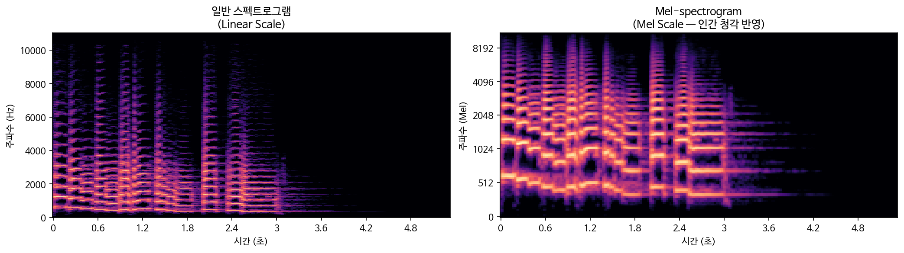
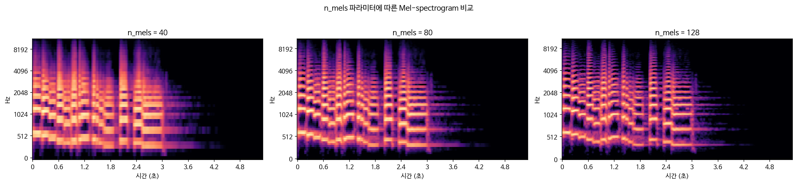
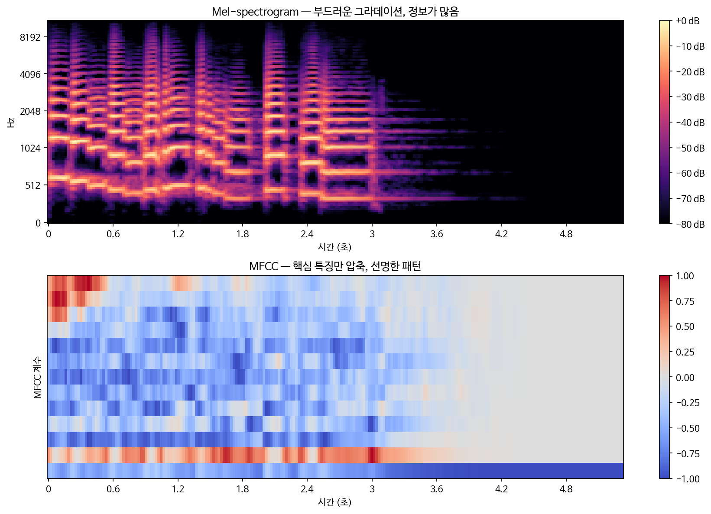

이번에는 소리를 **이미지로 시각화**하는 방법을 다뤄본다.
음성 AI 모델들이 소리를 어떻게 보는지 이해할 수 있다.

---

## 1. 일반 스펙트로그램 vs Mel-spectrogram

먼저 둘을 나란히 비교해보자.



왼쪽은 일반 스펙트로그램, 오른쪽은 Mel-spectrogram이다.
얼핏 비슷해 보이지만 y축(주파수 축)이 다르다.

- **일반 스펙트로그램**: 주파수가 선형(Linear)으로 균등하게 나뉜다.
- **Mel-spectrogram**: 주파수가 Mel Scale로 나뉜다.

---

## 2. 왜 굳이 'Mel'인가?

사람의 귀는 모든 주파수에 똑같이 반응하지 않는다.

- **저주파(100Hz~1000Hz)**: 작은 변화도 예민하게 느낀다.
- **고주파(10kHz~11kHz)**: 변화가 있어도 둔감하게 느낀다.

Mel Scale은 이 비선형적인 청각 특성을 수학적으로 반영한 척도다.

$$m = 2595 \cdot \log_{10}(1 + \frac{f}{700})$$

쉽게 말하면, **사람이 소리를 듣는 방식과 비슷하게 주파수를 재배열한 것**이다.
그래서 음성 AI 모델 입력으로 Mel-spectrogram이 가장 많이 쓰인다.

---

## 3. n_mels 파라미터

Mel-spectrogram을 만들 때 중요한 파라미터가 있다.



```python
mel = librosa.feature.melspectrogram(y=y, sr=sr, n_mels=128)
```

`n_mels`는 멜 필터의 개수다. 값이 클수록 주파수를 더 세밀하게 나눈다.

| n_mels | 특징 | 주로 쓰이는 곳 |
|---|---|---|
| 40 | 가볍고 빠름 | 경량 모델, 임베디드 |
| 80 | 균형잡힌 선택 | Whisper 기본값 |
| 128 | 세밀한 표현 | 고품질 TTS |

실제로 Whisper는 80개, 많은 TTS 모델은 128개를 쓴다.

---

## 4. MFCC

Mel-spectrogram을 한 번 더 압축한 것이 MFCC다.



두 그래프를 보면 차이가 확실히 느껴진다.

- **Mel-spectrogram**: 부드러운 그라데이션, 에너지 분포가 풍부하게 담김
- **MFCC**: 빨강/파랑 패턴이 선명, 핵심 특징만 압축됨

**왜 다를까?**

MFCC는 Mel-spectrogram에 **이산 코사인 변환(DCT)**을 적용해서 만든다.
DCT는 서로 비슷한 정보를 가진 주파수 대역들을 독립적인 성분으로 쪼개버린다.
그래서 에너지가 특정 계수에 강하게 집중되면서 패턴이 선명하게 보이는 것이다.

**MFCC 계수가 담는 정보**

- **0번 계수**: 전체 에너지(음량)
- **1~3번 계수**: 목소리의 전반적인 형태
- **4번 이후**: 세밀한 음색 특징

---

## 5. 그럼 어떨 때 쓰나?

| 구분 | Mel-spectrogram | MFCC |
|---|---|---|
| 정보량 | 많음 | 적음 (압축됨) |
| 주요 용도 | TTS, 고품질 음성인식 | 키워드 검출, 화자 식별 |
| 딥러닝 활용도 | 매우 높음 | 낮음 |
| 연산량 | 많음 | 적음 |

최근 Whisper 같은 대형 모델들은 MFCC를 거의 쓰지 않는다.
딥러닝 모델 성능이 좋아지면서, 사람이 미리 압축한 MFCC보다
**정보가 꽉 찬 Mel-spectrogram을 주는 게 더 좋은 결과**를 내기 때문이다.

그러나 MFCC는 아직도 경량 임베디드 장치나 화자 식별 분야에서
연산량이 적다는 장점으로 여전히 쓰인다.

---

## 마치며

다음 글에서는 Whisper에 대해 공부할 예정이다.
