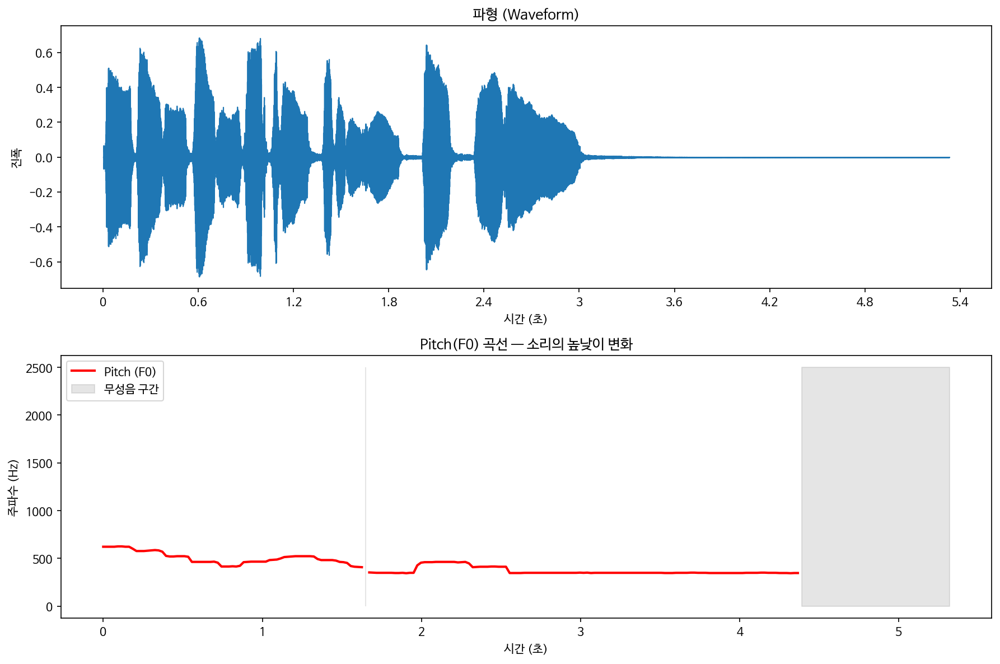
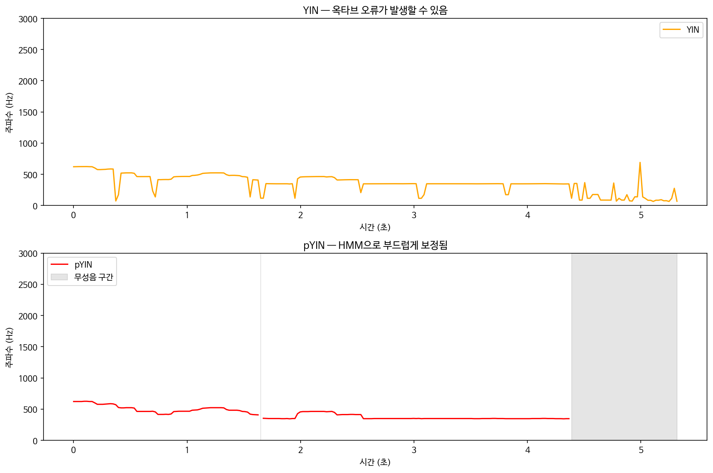
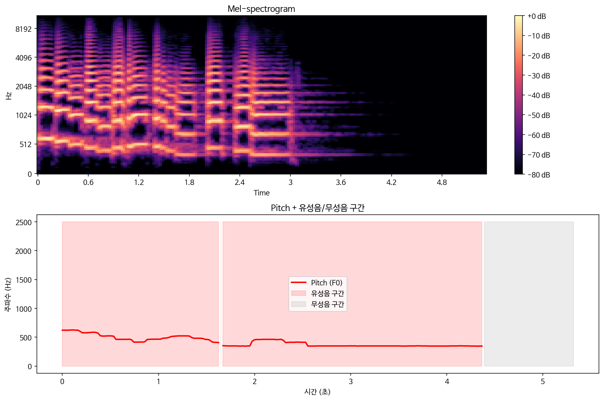

지금까지 소리의 **크기(파형)**, **주파수 분포(Mel-spectrogram)**, **텍스트 변환(Whisper)**을 공부했다.
이번에는 소리의 **높낮이(Pitch)** 를 데이터로 뽑아보는 실습을 할 것이다.

---

## 1. Pitch?

Pitch는 소리의 높낮이를 나타내는 값이다.

---

## 2. pYIN으로 Pitch 추출하기

```python
f0, voiced_flag, voiced_prob = librosa.pyin(
    y,
    fmin=librosa.note_to_hz('C2'),
    fmax=librosa.note_to_hz('C7')
)
```

결과를 시각화하면 이렇게 나온다.



위는 파형, 아래는 Pitch 곡선이다.
회색 구간은 소리가 없는 **무성음 구간**이다.

---

## 3. 왜 YIN이 아니라 pYIN인가?

Pitch를 추출하는 전통적인 알고리즘으로 YIN이 있다.

**YIN의 문제 — 옥타브 오류**

YIN은 순간적으로 실제 Pitch를 2배 또는 절반으로 잘못 잡는 오류가 생긴다.
귀로 들으면 멀쩡한 목소리인데, 데이터상으로는 갑자기 이상한 소리가 찍히는 현상이다.

**pYIN — 확률 모델(HMM)**

pYIN은 확률 모델(HMM, 은닉 마르코프 모델)과 결합했다.
이전 시점의 Pitch 값을 고려해서
"목소리가 0.01초 만에 갑자기 두 배로 튈 리 없다"는
확률적 계산으로 Pitch 곡선을 부드럽게 보정해준다.

아래 그래프에서 차이가 확실히 보인다.



위는 YIN, 아래는 pYIN이다.
pYIN이 훨씬 매끄럽고 안정적인 곡선을 보여준다.

---

## 4. 유성음과 무성음 — 소리의 두 가지 성질

`voiced_flag`를 뽑아보면 소리를 두 가지로 구분할 수 있다.



**유성음 (Voiced)**
성대가 주기적으로 떨리며 나오는 소리다.
'아', '이', '우' 같은 모음이 대표적이다.
주파수를 살펴보면 기본 주파수($F0$)의 정수배 자리에
에너지가 층층이 쌓이는 **하모닉스(Harmonics)** 구조가 나타난다.
pYIN이 Pitch 값을 쉽게 찾아내고 `voiced_flag = True`를 반환한다.

**무성음 (Unvoiced)**
성대 진동 없이 이빨이나 입술 사이로 공기가 스치는 소리다.
'스', '츠', '프' 같은 마찰음이 대표적이다.
주기성이 없고 수학적으로 화이트 노이즈에 가깝다.
Pitch를 정의할 수 없어서 `voiced_flag = False`가 된다.

---

## 5. VAD 프리뷰

**VAD (Voice Activity Detection)**

"지금 들어온 신호가 배경 소음인가, 대화인가?"를 구별하는 기술이다.
`voiced_flag`가 연속으로 `True`인 구간을 묶어내는 것이 바로 기본적인 VAD 로직의 출발점이다.

---

## 정리

지금까지 소리의 핵심 요소들을 하나씩 공부했다.
크기       →  파형 (Waveform)
주파수     →  Mel-spectrogram
내용       →  Whisper STT
길이       →  Duration (word_timestamps)
높낮이     →  Pitch (pYIN)
유/무성음  →  voiced_flag

다음에는 Whisper 논문을 읽으며
지금까지 실습한 것들이 논문 속에서 어떻게 설계됐는지 확인해볼 예정이다.
